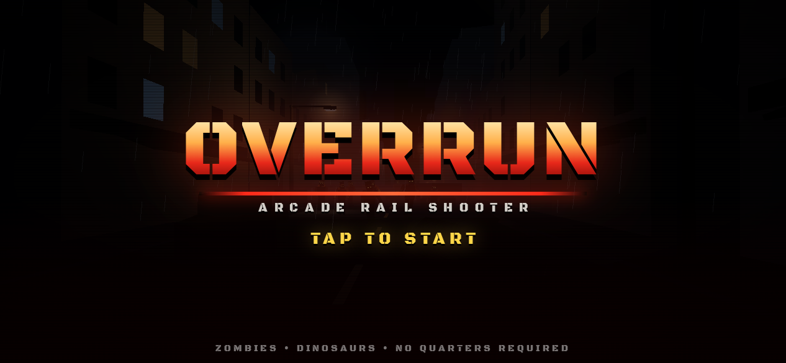
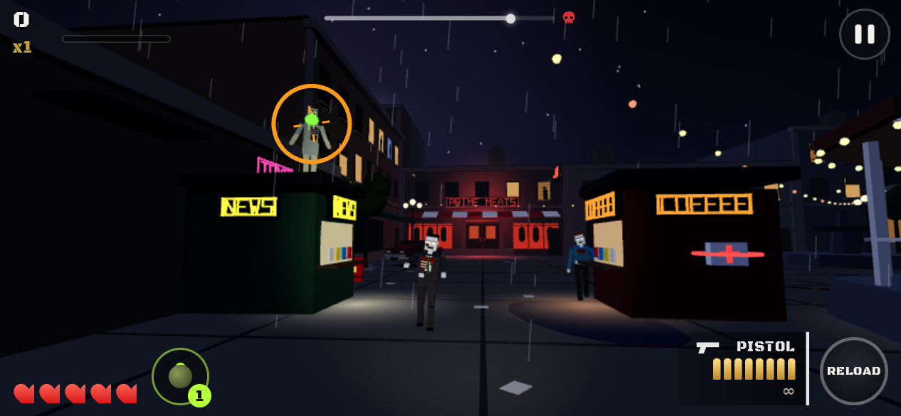
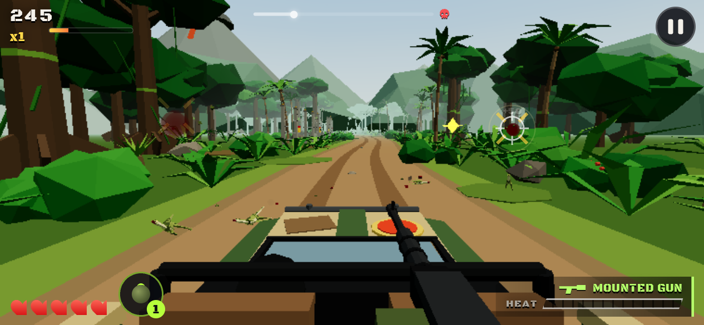
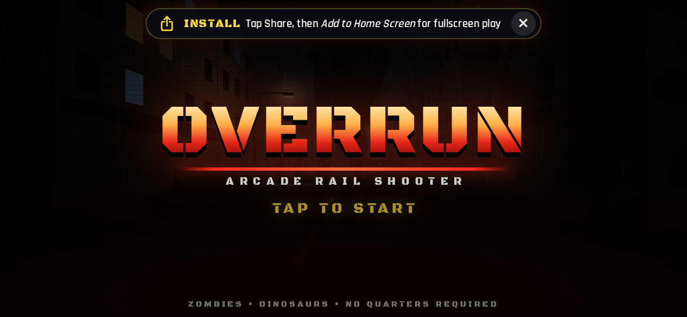

# OVERRUN

**An arcade on-rails light-gun shooter for your phone.** The camera charges down a rail through
two nightmare campaigns, **DEAD ZONE** (zombies) and **PRIMAL ISLAND** (dinosaurs), and
you **tap to shoot** whatever comes at you. Think *House of the Dead* or *Jurassic Park
Arcade*, built for a thumb on a touchscreen: three stages per campaign, a boss at the end
of each, combos, headshots, civilians to rescue and no quarters required.

All art and audio are **generated procedurally at runtime**: models are built from
primitives and sounds are synthesised with WebAudio. The whole game downloads in about
1.5 MB and plays offline.

<p align="center">
  
  
  
  
</p>

---

## Play on iPhone

iPhone is the main platform. Full step-by-step guide: **[docs/IOS.md](docs/IOS.md)**.

### Option A: install the web app (no Mac, 2 minutes)

1. Open **<https://rilltrill.github.io/Rilling/>** in **Safari** on your iPhone.
   GitHub Pages needs a one-time switch: repo **Settings → Pages → Source: GitHub Actions**.
   After that, every push to `main` redeploys automatically.
2. Tap **Share** (on iOS 26: **•••** then **Share**), then **Add to Home Screen**, then **Add**.
3. Launch **OVERRUN** from the home screen. It opens fullscreen, in landscape, and keeps
   working with no connection after the first launch.

### Option B: native app

- **With a Mac and a free Apple ID:** run `npm ci && npm run build && npx cap sync ios && npx cap open ios`.
  In Xcode, pick your Personal Team, select your iPhone and press Run. ([details](docs/IOS.md#b-run-the-native-app-on-your-own-iphone-mac--free-apple-id))
- **No Mac, through TestFlight:** add the seven signing secrets to the repo and GitHub Actions builds
  and uploads every `main` build to TestFlight. ([details](docs/IOS.md#c-testflight-builds-from-github-actions-no-mac-needed))

The native app adds haptics, a landscape lock, keep-awake, and edge-swipe protection so a frantic
swipe doesn't open Notification Centre.

---

## How to play

| | Touch | Keyboard / mouse |
|---|---|---|
| **Shoot** | **Tap** the target. Hold to keep firing | Left click (hold for auto) |
| **Reload** | **Swipe down**, or tap **RELOAD**. Auto-reload is on by default | Right click, `R` or `Space` |
| **Switch weapon** | Tap the weapon panel (bottom right; a callout points at it the first few times). Vehicle sections lock you to the mounted gun. | `1`–`4`, `Q` / `Tab` |
| **Bomb** (clears the screen) | Bomb button (bottom left) | `B` |
| **Pause** | ❚❚ (top right) | `Esc` / `P` |

- **Red shrinking rings mean an attack is coming.** Shoot that enemy before the ring closes.
  Any hit staggers it.
- **Headshots** do 2.5× damage and score extra. Big enemies and bosses have **glowing weak points**.
- **Shoot crates** to collect first-aid kits, shotguns, SMGs, magnums and bombs.
- **Don't shoot civilians.** Save them for a bonus.
- **Combos:** every 5 hits in a row adds +0.5× to your score multiplier, up to **×4**. A miss resets it.
- Stages end with a letter grade from **S** to **D**, based on accuracy, damage taken,
  headshots, combo and continues.

---

## Develop

Requires **Node.js 22.12+**.

```bash
npm ci
npm run dev              # dev server on http://localhost:5173 (also on your LAN, for phones)
npm run typecheck        # tsc --noEmit
npm test                 # vitest: unit tests + headless stage simulator (plays every stage)
npm run e2e:phone        # Playwright on a landscape Chromium phone (builds + serves dist/)
npm run e2e              # …plus the WebKit iPhone project (needs `npx playwright install webkit`)
npm run build            # typecheck + production build → dist/ (with service worker)
npm run build:single     # one self-contained HTML file → dist-single/overrun.html
npm run icons            # regenerate icons + launch images (web, iOS, Android) from public/icon.svg
node scripts/snap.mjs --url "http://localhost:5173/?stage=z1&autoplay=1&god=1" --out /tmp/shot --count 3
```

### Debug URL flags

| Flag | Effect |
|---|---|
| `?stage=z1` | Jump straight into a stage (`z1 z2 z3` zombies, `d1 d2 d3` dinosaurs, `zoo` test arena) |
| `&beat=5` | Start at beat 5 of the stage script |
| `&autoplay=1` | Aimbot plays for you |
| `&god=1` | Invulnerable |
| `&speed=2` | Time scale |
| `&debug=1` | Beat / rail overlay |
| `&seed=42` | Fixed random seed |
| `&mute=1` | No audio |
| `?installhint=1` | Force the iPhone "Add to Home Screen" hint (for testing) |

`window.__game` exposes the running game for tests and the console.

### Architecture

TypeScript + Three.js + Vite, with Capacitor for the native shells. Start with
**[docs/ARCHITECTURE.md](docs/ARCHITECTURE.md)**. It covers the engine, the rail-shooter framework,
stage scripting, enemies, bosses and the procedural model kit.

```
src/core       engine, input, save, haptics          src/gameplay   rail rig, stage runner, enemies, bosses
src/content    procedural models, enemies, stages    src/ui         HUD + menus (DOM)
src/audio      synthesised SFX + music               src/platform   iOS / PWA / native bootstrapping
ios/  android/ Capacitor native projects             tests/         vitest (unit + stage sim), Playwright e2e
```

---

## Deploy

- **GitHub Pages** (`.github/workflows/pages.yml`): builds `dist/` and publishes it on every push to `main`
  and to `claude/arcade-rail-shooter`. Enable it once under **Settings → Pages → Source: GitHub Actions**.
  To let the feature branch deploy, also allow it in **Settings → Environments → github-pages**.
  Vite's `base` is `./`, so the game works from any sub-path.
- **Single file:** `npm run build:single` produces `dist-single/overrun.html` (about 1 MB) with all JS, CSS,
  fonts and icons inlined. Open it from disk, host it anywhere, or share it as a claude.ai artifact.
  CI attaches it to every run as the `overrun-single-file` artifact.
- **Offline / PWA:** the build emits `sw.js`. It precaches the hashed app shell, serves assets
  cache-first and `index.html` network-first, and drops old caches when a new version activates.

### CI

| Workflow | What it does |
|---|---|
| `ci.yml` | Typecheck, vitest, build, single-file build, Playwright on Chromium (phone) **and** WebKit (iPhone). Uploads screenshots and the single HTML file |
| `ios.yml` | Unsigned iOS Simulator build on macOS (artifact). Optional signed TestFlight upload |
| `pages.yml` | Deploys to GitHub Pages |
| `android.yml` | Debug APK (artifact) |

## Android (secondary)

`android/` is a Capacitor project: landscape, immersive fullscreen, keep-screen-on. Run
`npm run cap:android` to open it in Android Studio. CI builds a debug APK on every push; download it
from the **Android** workflow's artifacts and open it on the phone to install. The web app also
installs from Chrome via **⋮ → Install app**.

## Credits & licences

- Game code, procedural models and audio: the OVERRUN team.
- Fonts: **Black Ops One** (James Grieshaber) and **Rajdhani** (Indian Type Foundry), both under the
  [SIL Open Font License 1.1](https://openfontlicense.org), bundled through [@fontsource](https://fontsource.org).
- [three.js](https://threejs.org) (MIT), [Capacitor](https://capacitorjs.com) (MIT), [Vite](https://vite.dev) (MIT).
